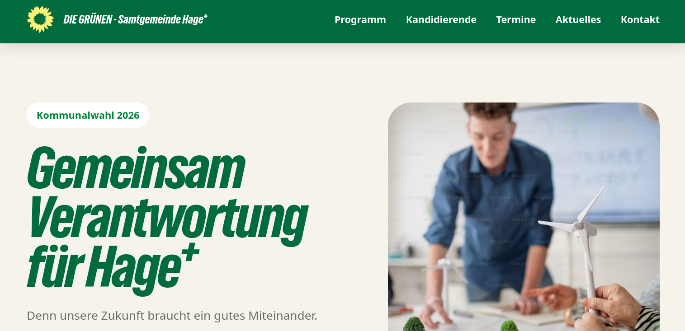

# Gruene-Hage

[Deutsch](#deutsch) | [English](#english)

---

## English

This repository serves as a lightweight public reference for the website:

**[https://meine-domain](https://www.gruene-hage.de/)**

The purpose of this repository is to provide a concise overview of the project and a publicly accessible location where interested visitors can find the website and a visual preview.

### Website

[https://meine-domain](https://www.gruene-hage.de/)

### Screenshot

### About

The primary content and ongoing development are hosted on the website itself. This repository is intentionally kept minimal and contains only a reference link and supporting media.

For the latest information, documentation, and updates, please visit:

**[https://meine-domain](https://www.gruene-hage.de/)**

---

## Deutsch

Dieses Repository dient als kompakte öffentliche Referenz für die Website:

**[https://meine-domain](https://www.gruene-hage.de/)**

Ziel dieses Repositories ist es, interessierten Besuchern einen kurzen Überblick über das Projekt sowie eine öffentlich zugängliche Verlinkung zur Website einschließlich einer visuellen Vorschau bereitzustellen.

### Website
[
https://meine-domain](https://www.gruene-hage.de/)

### Screenshot

### Über das Projekt

Die eigentlichen Inhalte sowie die laufende Weiterentwicklung finden direkt auf der Website statt. Dieses Repository wird bewusst schlank gehalten und enthält lediglich eine Referenz auf das Projekt sowie begleitendes Bildmaterial.

Aktuelle Informationen, Dokumentation und Updates finden Sie unter:

**[https://meine-domain](https://www.gruene-hage.de/)**
